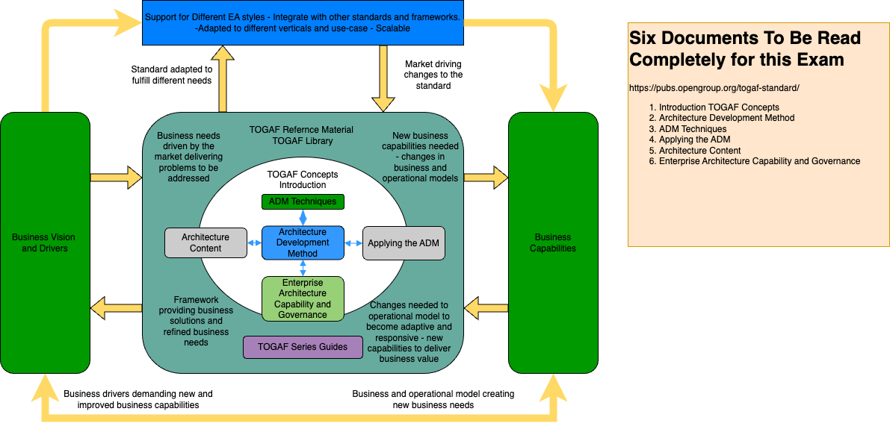

# TOGAF Enterprise Architecture Study Guide

## **What is TOGAF?**

TOGAF (The Open Group Architecture Framework) is a globally recognized framework for designing, planning, implementing, and governing enterprise architectures. It helps organizations **align business goals with IT strategy**, ensuring that technology investments support business growth, efficiency, and innovation.

Think of TOGAF as a **blueprint for building a strong company**—just like an architect designs a building, enterprise architects use TOGAF to structure IT and business processes in a scalable, efficient way.

TOGAF is like a **playbook for business transformation**. It ensures that investments in technology—whether in digital platforms, cloud computing, or automation—are **strategic, cost-effective, and aligned with company goals**. TOGAF helps businesses avoid inefficiencies, reduce risks, and adapt to change while improving operational performance.

By following TOGAF’s structured **Architecture Development Method (ADM)**, organizations can create roadmaps for modernizing legacy systems, integrating new technologies, and optimizing business processes. Whether it’s a **bank upgrading its digital banking platform**, a **hospital implementing electronic health records**, or a **retail company enhancing customer experience with AI**, TOGAF provides the structure and best practices to ensure success.

TOGAF is widely adopted by **large enterprises, governments, and organizations** worldwide, offering a proven methodology to **reduce complexity, improve agility, and maximize the value of IT investments**.

# Welcome

Welcome to the **TOGAF EA Study Guide** repository! This project is designed to help you prepare for the **TOGAF Enterprise Architecture Part 1 Exam** and provide practical tools for Enterprise Architecture (EA) projects using the TOGAF framework.

## Purpose
- **Exam Preparation:** Study resources including summaries of the Architecture Development Method (ADM) phases and a practice test.
- **Practical Application:** Reusable Markdown templates for creating EA deliverables aligned with TOGAF phases.
- **Current as of:** March 2025, based on the TOGAF Standard, 10th Edition.

## Repository Structure
- **[ADM/](ADM/README.md)**: Summaries of each TOGAF ADM phase for study and reference.
  - [Preliminary Phase](ADM/Preliminary.md)
  - [Phase A: Architecture Vision](ADM/Phase-A_Architecture-Vision.md)
  - [Phase B: Business Architecture](ADM/Phase-B_Business-Vision.md)
  - [Phase C: Information Systems Architecture](ADM/Phase-C_Information-Systems-Architecture.md)
  - [Phase D: Technology Architecture](ADM/Phase-D_Technology-Architecture.md)
  - [Phase E: Opportunities and Solutions](ADM/Phase-E_Opportunities-and-Solutions.md)
  - [Phase F: Migration Planning](ADM/Phase-F_Migration-Planning.md)
  - [Phase G: Implementation Governance](ADM/Phase-G_Implementation-Governance.md)
  - [Phase H: Architecture Change Management](ADM/Phase-H_Architecture-Change-Management.md)
  - [Requirements Management](ADM/Requirements-Management.md)

- **[Templates/](Templates/)**: Reusable Markdown templates for EA project deliverables.
  - [Architecture Vision](Templates/Architecture-Vision.md)
  - [Business Architecture Template](Templates/Business-Architecture-Template.md)
  - [Data Architecture Template](Templates/Data-Architecture-Template.md)
  - [Application Architecture Template](Templates/Application-Architecture-Template.md)
  - [Technology Architecture Template](Templates/Technology-Architecture-Template.md)
  - [Migration Plan Template](Templates/Migration-Plan-Template.md)
  - [Implementation Governance Template](Templates/Implementation-Governance.md)
  - [Stakeholder Map](Templates/Stakeholder-Map.md)

- **[Practice-Tests/](Practice-Tests/)**: Practice questions to test your TOGAF knowledge.
  - [TOGAF Part 1 Practice Test (50 Questions)](Practice-Tests/TOGAF-Part1-Practice-Test.md)

## What’s New in TOGAF 10?

The TOGAF Standard, 10th Edition introduces several key improvements:

- **Modular Structure** – More flexible guidance, allowing organizations to adopt relevant aspects of TOGAF without implementing the entire framework.
- **Enhanced Guidance** – Expanded topics including Agile integration, digital transformation, and security architecture.
- **Improved Accessibility** – Clearer documentation and digital resources to make TOGAF easier to adopt.

For more details, visit [The Open Group's official site](https://www.opengroup.org/togaf/new-version).

## Recommended Study Resources

To support your learning and certification preparation, consider the following:

- **[TOGAF® Enterprise Architecture Foundation Study Guide](https://www.amazon.com/TOGAF%C2%AE-Enterprise-Architecture-Foundation-Study/dp/940181015X/)** – Covers the TOGAF Standard, 10th Edition, including key concepts and practice questions.
- **[Official TOGAF Practice Tests](https://www.opengroup.org/certifications/study-guides-and-practice-test)** – Useful for self-assessment before the exam.

## How to Use This Guide

1. **Review the ADM Phase Summaries** – Understand the purpose, inputs, steps, and outputs of each phase in `ADM/`.
2. **Use the Templates** – Apply the provided templates to structure your own EA documents.
3. **Test Your Knowledge** – Work through the sample questions with:
 * [Docker interactive quiz](./Practice-Tests/README.md) 
 * [Practice Test](./Practice-Tests/Practice-Test-1.md)
4. **Engage with the TOGAF Community** – Join online discussions and forums to share insights and ask questions.

## Applying TOGAF 



## Contributing

Contributions are welcome! If you have suggestions, corrections, or additional study materials to share, feel free to submit a pull request or open an issue.

## Disclaimer

This guide is intended to supplement your study for the TOGAF certification exam. It is recommended to use official TOGAF documentation and accredited training materials for comprehensive exam preparation.

## How to Use
1. **Clone the Repository:** 
   ```bash
   git clone https://github.com/fbooth-elevatus/togaf_ea_studyguide.git
   
Copyright (c) 2025 Francis Booth, Elevatus Consulting LLC [fbooth-elevatus]
[MIT License](LICENSE)